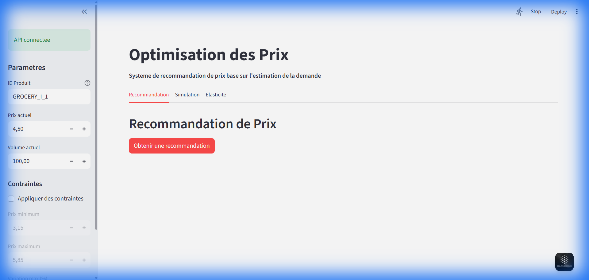
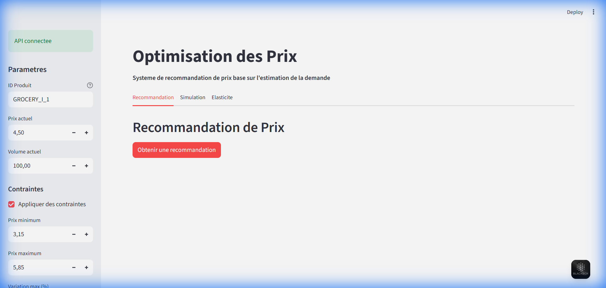
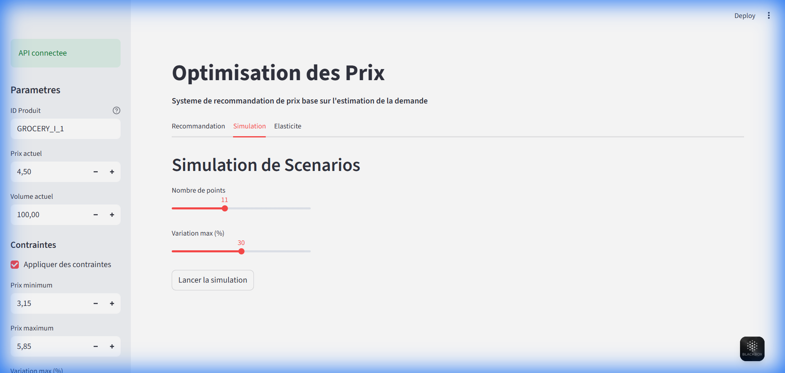
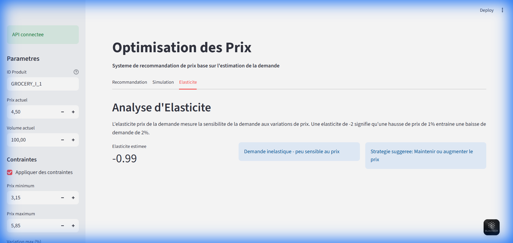

# Guide Utilisateur : Application d'Optimisation des Prix

Bienvenue dans le guide utilisateur de l'application d'optimisation des prix. Cette application permet de recommander, simuler et analyser les prix produits en fonction de la demande estimée par Machine Learning.

## ⚙ Configuration & Paramètres (Sidebar)

La barre latérale gauche (Sidebar) est le point de contrôle principal pour configurer les données du produit et les contraintes d'optimisation.

### Champs disponibles :

*   **ID Produit** : Identifiant unique du produit à analyser (ex: `GROCERY_I_1`).
*   **Prix actuel** : Le prix de vente actuel du produit en euros.
*   **Volume actuel** : Le volume de ventes actuel (hebdomadaire/mensuel selon le modèle).
*   **Contraintes** :
    *   ☑ **Appliquer des contraintes** : Active ou désactive les bornes de prix.
    *   **Prix minimum / maximum** : Plage de prix autorisée pour la recommandation.
    *   **Variation max (%)** : Limite l'écart maximal par rapport au prix actuel (ex: ±20%).

---

## 📊 Fonctionnalités Principales

L'application est divisée en trois onglets accessibles en haut de la page principale.

### 1. Recommandation de Prix

Cet onglet fournit une recommandation directe du prix optimal pour maximiser le revenu ou la marge, tout en respectant les contraintes définies.

*   **Prix recommandé** : Le nouveau prix suggéré.
*   **Volume attendu** : Estimation des ventes au nouveau prix.
*   **Revenu attendu** : Revenu prévisionnel.
*   **Marge attendue** : Marge estimée (si les coûts sont intégrés).

### 2. Simulation de Scénarios

Cet onglet permet d'explorer visuellement comment le revenu et le volume réagissent à différentes variations de prix.

*   **Graphique interactif** :
    *   Courbe bleue (ligne continue) : Revenu attendu.
    *   Courbe rose (pointillés) : Volume attendu.
*   **Contrôles** : Ajustez le nombre de points de simulation et l'étendue de la variation (%).
*   **Tableau** : Détail chiffré des simulations en bas de page.

### 3. Analyse d'Élasticité

Cet onglet analyse la sensibilité de la demande par rapport au prix (élasticité-prix).

*   **Élasticité estimée** : Valeur numérique de l'élasticité.
    *   Si valeur < -1 : Demande élastique (sensible au prix).
    *   Si valeur > -1 : Demande inélastique (peu sensible).
*   **Stratégie suggérée** : Conseil automatisé (baisser ou augmenter le prix) basé sur l'élasticité calculée.

---

## 🛠 Support

Pour toute question technique ou problème avec l'application, veuillez contacter l'équipe Data Science ou ouvrir un ticket dans le gestionnaire de projet.
