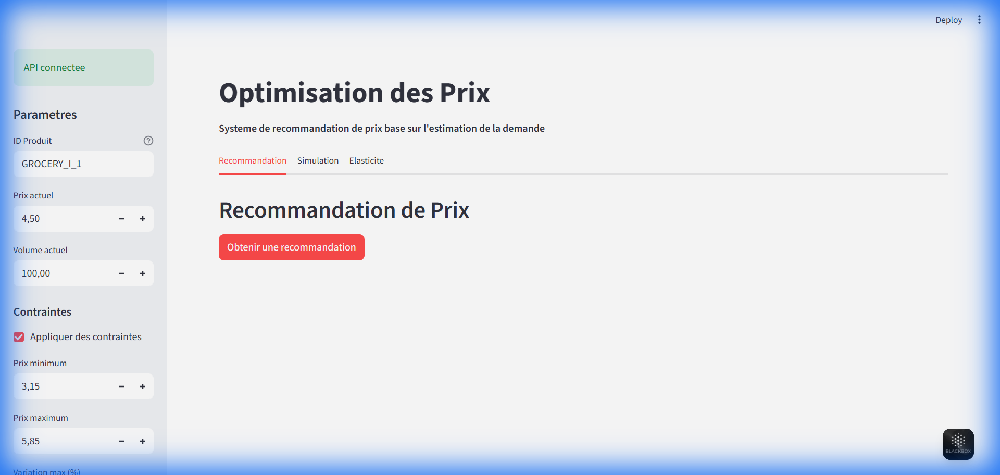

# MLOps Pricing Optimization

<p align="center">
  
  
  
  
  
  
</p>

---

## Objectif

Systeme complet d'optimisation des prix base sur l'estimation de la demande. Ce projet implemente un pipeline MLOps de bout en bout permettant de:

- Estimer l'elasticite prix de la demande
- Predire les volumes de vente en fonction du prix
- Recommander des prix optimaux sous contraintes metier
- Exposer les recommandations via API REST et interface utilisateur

---

## Architecture

```
+----------------+     +------------------+     +-------------------+
|   Raw Data     | --> |  Feature Eng.    | --> |   Demand Model    |
|   (Kaggle)     |     |  (Price proxy)   |     |   (LightGBM)      |
+----------------+     +------------------+     +-------------------+
                                                         |
                                                         v
+----------------+     +------------------+     +-------------------+
|   Streamlit    | <-- |   FastAPI        | <-- |  Price Optimizer  |
|   Dashboard    |     |   /recommend     |     |   (SciPy)         |
+----------------+     +------------------+     +-------------------+
```

---

## Stack Technique

| Composant | Technologie |
|-----------|-------------|
| Donnees | Pandas, DVC |
| ML | LightGBM, Scikit-learn, Optuna |
| Tracking | MLflow |
| Config | Hydra |
| API | FastAPI, Pydantic v2 |
| UI | Streamlit, Plotly |
| CI/CD | GitHub Actions |
| Infra | Docker Compose |

---

## Interface

<p align="center">
  
</p>


Le dashboard Streamlit permet de:
- Obtenir des recommandations de prix en temps reel
- Simuler l'impact de differents scenarios de prix
- Analyser l'elasticite prix pour chaque produit

➤ **Consultez le [Guide Utilisateur](GUIDE_UTILISATEUR.md) pour une visite guidée complète de l'application.**

---

## Installation


Pour un guide détaillé sur l'installation et la configuration de l'environnement, voir [SETUP.md](SETUP.md).

```bash
# Cloner le depot
git clone https://github.com/Souley225/mlops-pricing-optimization.git
cd mlops-pricing-optimization

# Installer les dependances
poetry install

# Copier la configuration
cp .env.example .env
```

---

## Utilisation

### Pipeline complet

```bash
# Executer tout le pipeline
dvc repro

# Ou etape par etape
make data        # Telecharger et preparer les donnees
make features    # Construire les features
make train       # Entrainer le modele
make evaluate    # Evaluer et calculer l'elasticite
make optimize    # Generer les recommandations
```

### Services

```bash
# Lancer tous les services
docker compose up -d

# API disponible sur http://localhost:8000
# UI disponible sur http://localhost:8501
# MLflow disponible sur http://localhost:5000
```

### Tests

```bash
# Lancer les tests
pytest tests/ -v

# Avec couverture
pytest tests/ --cov=src --cov-report=html

# Qualite du code
make lint        # ruff check
make format      # ruff format
make typecheck   # mypy
```

---

## API

### POST /recommend_price

Recommande un prix optimal pour un produit.

**Request:**
```json
{
  "product_id": "GROCERY_I_1",
  "current_price": 4.50,
  "constraints": {
    "min_price": 3.50,
    "max_price": 6.00
  }
}
```

**Response:**
```json
{
  "recommended_price": 4.15,
  "expected_volume": 1250.5,
  "expected_revenue": 5189.58,
  "expected_margin": 1297.39,
  "model_version": "1.2.0"
}
```

---

## Structure du Projet

```
mlops-pricing-optimization/
├── configs/              # Configuration Hydra
├── src/
│   ├── data/            # Ingestion et preparation
│   ├── features/        # Feature engineering
│   ├── models/          # Training, evaluation, optimization
│   ├── serving/         # API FastAPI
│   ├── ui/              # Interface Streamlit
│   └── utils/           # Utilitaires partages
├── tests/               # Tests unitaires et integration
├── docker/              # Dockerfiles
├── dvc.yaml             # Pipeline DVC
└── compose.yaml         # Docker Compose
```

---

## License

MIT
